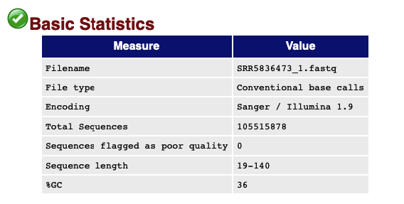
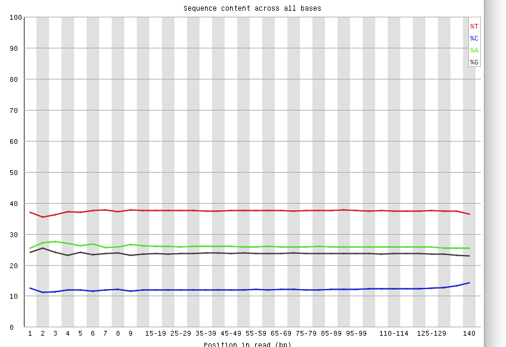
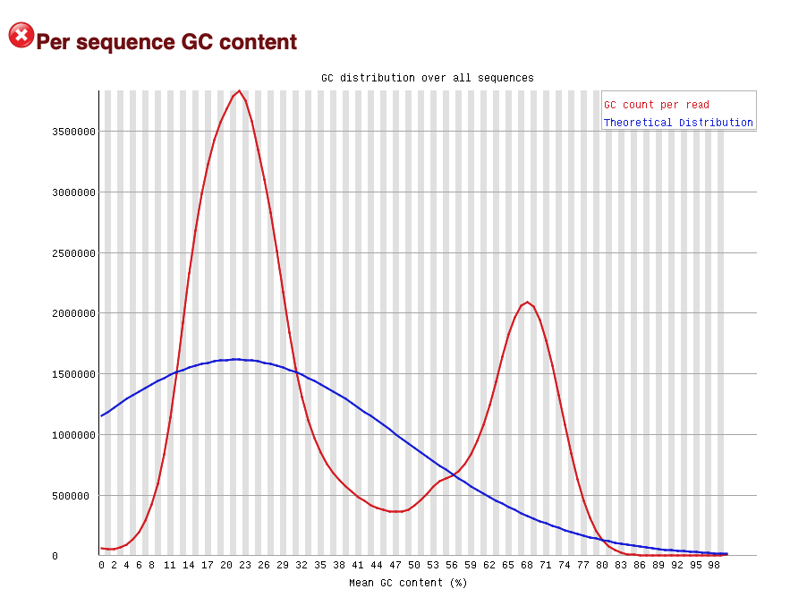
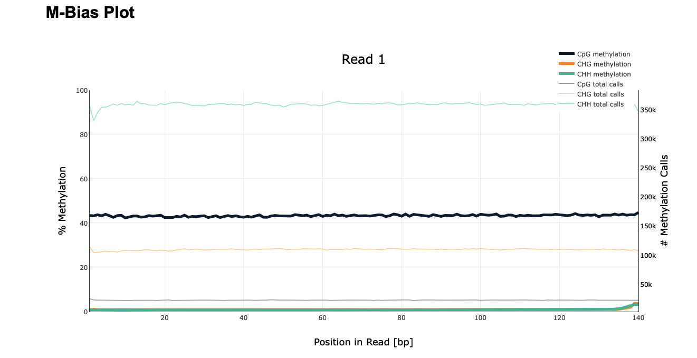
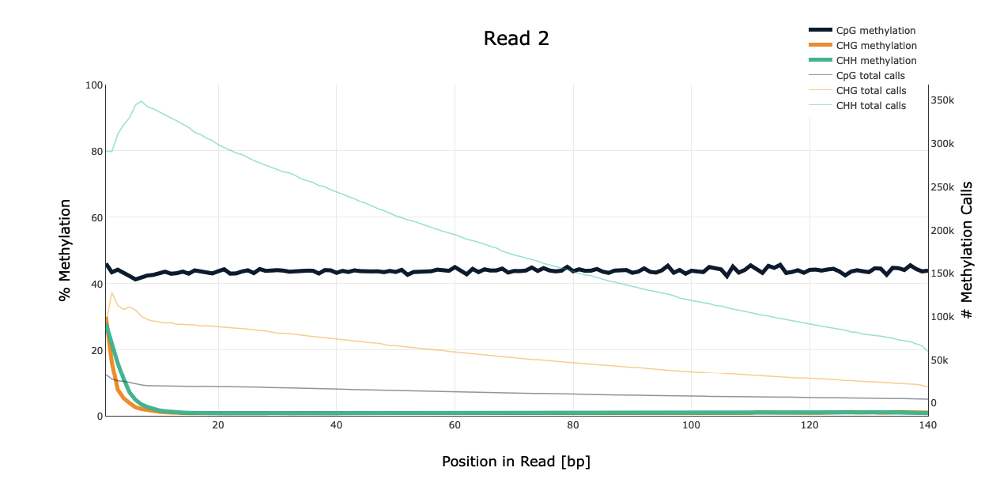
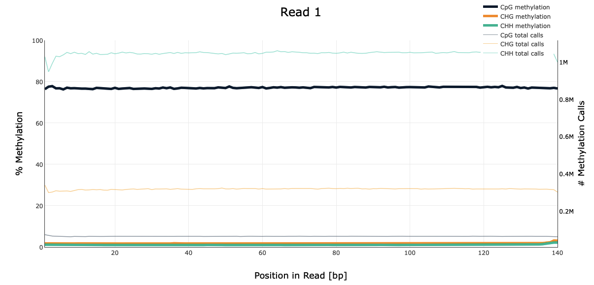
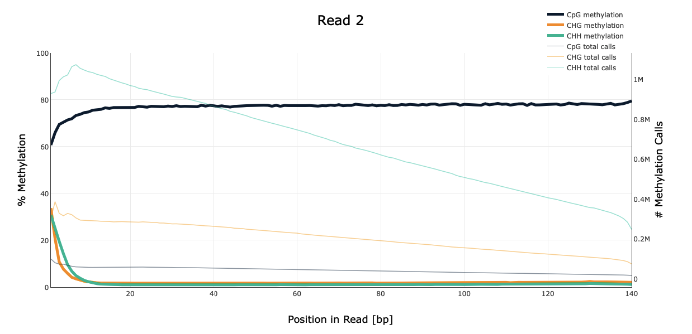
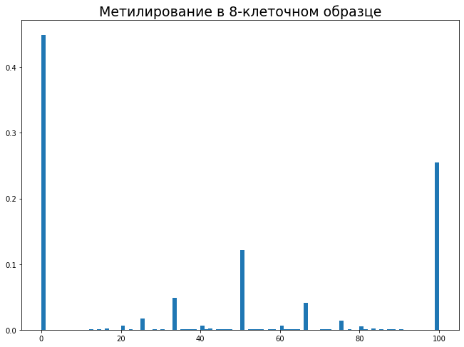
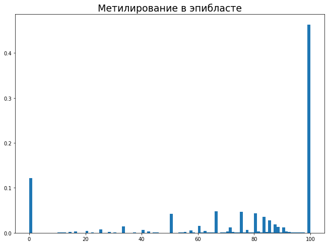
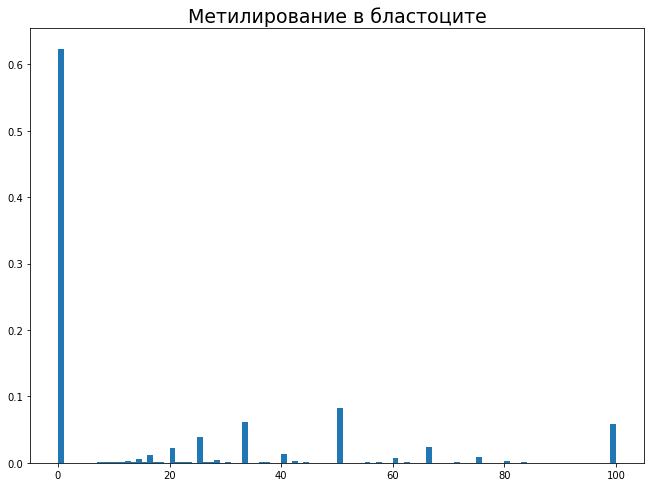

# hse_hw1_meth  
Cсылка на GoogleCollab https://colab.research.google.com/drive/13X6MmvM2SARDmd05_Hf4Dcfi2y9YLskL?usp=sharing  
В процессе обработки произошла опечатка, которая не позволила сгенерировать правильный html-отчёт для образца ICM, поэтому для исправления этой ошибки выл создан отдельный блокнот: https://colab.research.google.com/drive/1dzAKuJsWPuxZPSmeERfV9rR7Ibj8xvLe?usp=sharing
## 1. Анализ FastQC  
Для анализа был выбран образец, представляющий восьмиклеточную стадию.
  
Базовая статистика показывает, что содержание CG в данном образце составляет 36 процентов, тогда как по данным ДНК-секвенирования эта цифра была около 49%. Это ожидаемо, учитывая, что в процессе бисульфидного секвенирования неметилированные цитозины заменяются на урацилы, а для восьмиклеточной стадии ожидается гораздо более низкий по сравнению со стандартными клеткамии процент метилирования.  
  
Аналогично можно объяснить и разницу в количестве различных оснований в чтениях. Для данных ДНК-секвенирования по большей части наблюдаются примерно равные количества комплементарных оснований, однако для наших данных можно видеть заметное повышение количества тимина и понижение цитозина по сравнению с аденином и гуанином. Это так же объясняется тем, что в ходе бисульфитного секвенирования неметилированный цитозин превращается в урацил, который затем заменяется на тимин; ввиду невысокого уровня метилирования на данной стадии это приводит к значительному снижению содерания цитозина и повышению содержания тимина.  
  
Данный график, к сожалению, содержит какую-то ошибку, отчего полностью полагаться на его данные нельзя. Так, например, я не могу объяснить появление второго пика в правой части графика. Однако пик в левой части согласуется с нашими данными: по уже описанным выше причинам, снижение количества CG фрагментов в образце с пониженным метилированием ожидаемо.   
  
## 2. BAM-выравнивание и таблица
ОБРАЗЕЦ | РАСШИФРОВКА | РИДОВ, ЗАКАРТИРОВАННЫХ НА УЧАСТКЕ 11347700-11367700 | РИДОВ, ЗАКАРТИРОВАННЫХ НА УЧАСТКЕ 40185800-40195800  
---- | ----- | ----- | -----  
SRR5836473 | 8-cell | 1090 | 464  
SRR3824222 | Epiblast | 2328 | 1062  
SRR5836475 | ICM | 1456 | 630  
## 3. Дедупликация  
ОБРАЗЕЦ | ДУПЛИЦИРОВАННЫХ ЧТЕНИЙ | ДУПЛИЦИРОВАННЫХ ЧТЕНИЙ (В %)  
---- | ----- | -----
SRR5836473 | 521904 | 18.31  
SRR3824222 | 205258 | 2.92  
SRR5836475 | 377882 | 9.08  
## 4. M-Bias  
### 8-cell - 2+ дня после оплодотворения  
  
  
### ICM - 3.5 дня после оплодотворения   
  
  
### Epiblast - 6.5 дней после оплодотворения  
  
  
По данным графиков M-Bias видно, что, как и было предположено, уровень метилирования в контексте CpG на разных стадиях развития эмбриона существенно различается. Для восьмклеточной стадии он сравнительно невысок (около 40%), ещё ниже (около 20%) на стадии бластоцита и существенно выше (немногим ниже 80%) на стадии эпибласта. Это согласуется с теми данными, которые приведены в задании.  
Также для всех трёх образцов можно видеть, что доля метилирования в отличных от CpG контекстах приближена к нулю.  
## 5. Гистограммы метилирования  
 
  
 
