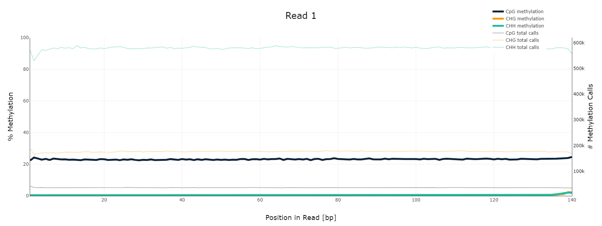

# hse_hw1_meth  
Cсылка на GoogleCollab https://colab.research.google.com/drive/13X6MmvM2SARDmd05_Hf4Dcfi2y9YLskL?usp=sharing  
В процессе обработки произошла опечатка, которая не позволила сгенерировать правильный html-отчёт для образца ICM, поэтому для исправления этой ошибки выл создан отдельный блокнот: https://colab.research.google.com/drive/1dzAKuJsWPuxZPSmeERfV9rR7Ibj8xvLe?usp=sharing
## 1. Анализ FastQC  
  
  
## 2. BAM-выравнивание и таблица
ОБРАЗЕЦ | РАСШИФРОВКА | РИДОВ, ЗАКАРТИРОВАННЫХ НА УЧАСТКЕ 11347700-11367700 | РИДОВ, ЗАКАРТИРОВАННЫХ НА УЧАСТКЕ 40185800-40195800  
---- | ----- | ----- | -----  
SRR5836473 | 8-cell | 1090 | 464  
SRR3824222 | Epiblast | 2328 | 1062  
SRR5836475 | ICM | 1456 | 630  
## 3. Дедупликация  
ОБРАЗЕЦ | ДУПЛИЦИРОВАННЫХ ЧТЕНИЙ | ДУПЛИЦИРОВАННЫХ ЧТЕНИЙ (В %)  
---- | ----- | -----
SRR5836473 | 521904 | 18.31  
SRR3824222 | 205258 | 2.92  
SRR5836475 | 377882 | 9.08  
## 4. M-Bias  
  
  
  
  
  
  
## 5. Гистограммы метилирования  
 
  
 
